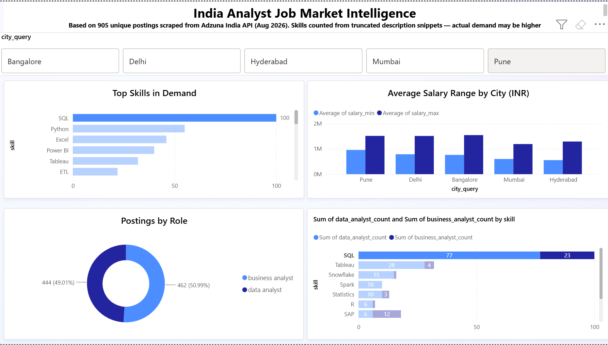

# 📈 Adzuna Job Market Intelligence — Weekly Analyst Job Pipeline

*A scheduled data pipeline that tracks skill demand and salary trends for analyst-track roles across five Indian cities, with automated weekly ingestion via GitHub Actions.*


---

## 🎯 Overview

Which tools and skills appear most in Indian data/business analyst job postings?
How do salaries vary by city and role? Which companies are hiring most?

This pipeline answers those questions with real, weekly-updated data rather than
a one-time snapshot. The dataset grows automatically each week via GitHub Actions,
so trend claims are grounded in actual run history — not extrapolated from a
single pull.

### 📊 Key Numbers

| Metric | Value | Context |
|--------|-------|---------|
| Title buckets | 2 | `"data analyst"`, `"business analyst"` |
| Cities | 5 | Delhi, Bangalore, Mumbai, Hyderabad, Pune |
| Results per page | 50 | API maximum |
| Base API calls / run | 10 | 2 titles × 5 cities |
| Max API calls / run | 20 | Hard cap: 1 extra page per combination |
| Run frequency | Weekly | Monday 02:00 UTC via cron |
| Estimated runs / month | ~4.3 | Based on weekly schedule |
| Estimated calls / month | ~43–86 | Well under free-tier ceiling |
| Free-tier budget | ~1,000 / month | Adzuna API |
| Skills dictionary | 30 terms | Regex patterns in `config/skills.yml` |
| Postings ingested (run 1) | 905 | Unique job IDs in `data/jobs.db` |
| Postings ingested (run 2) | 906 | 1 genuinely new posting added |
| Duplicate re-inserts | 0 | Confirmed by `skipped_duplicates` in run log |

---

## 🏗️ Architecture — Four Stages

```
┌─────────────────────────────────────────────────────────────┐
│  Stage 1 · Ingestion                                        │
│  scripts/ingest.py                                          │
│  - 10 API calls (2 titles × 5 cities), max 20 with paging  │
│  - Raw JSON saved → data/raw/run_YYYYMMDD.json              │
│  - Deduplication: INSERT OR IGNORE on Adzuna job ID (PK)    │
│  - Skill extraction via config/skills.yml regex patterns    │
└────────────────────────┬────────────────────────────────────┘
                         │
┌────────────────────────▼────────────────────────────────────┐
│  Stage 2 · Storage                                          │
│  data/jobs.db (SQLite)                                      │
│  - postings table: one row per unique job posting           │
│  - posting_skills table: posting ↔ skill junction           │
└────────────────────────┬────────────────────────────────────┘
                         │
┌────────────────────────▼────────────────────────────────────┐
│  Stage 3 · Quality Checks                                   │
│  scripts/validate.py → logs/validation_log.txt              │
│  - Duplicate PK check                                       │
│  - Salary min/max consistency check                         │
│  - Malformed record count from run log                      │
└────────────────────────┬────────────────────────────────────┘
                         │
┌────────────────────────▼────────────────────────────────────┐
│  Stage 4 · Presentation                                     │
│  Power BI Desktop                                           │
│  - ODBC path: connect directly to data/jobs.db              │
│  - Fallback: data/exports/postings_flat.csv + skill_counts  │
│  - 4 visuals: skill frequency, salary by city,              │
│    postings by title bucket, top companies                  │
└─────────────────────────────────────────────────────────────┘
```

**Why SQLite over DuckDB?**
- This project's ingestion pattern is a scheduled REST API pull, not a bulk file load — SQLite's row-level `INSERT OR IGNORE` is a better fit than DuckDB's columnar bulk-load model.
- `data/jobs.db` is committed to the repo so Power BI can connect to a local file path and the dataset visibly grows each week in git history.

**Why a fixed query plan?**
- The free tier allows roughly 1,000 calls/month. Ten base calls per run × 4.3 runs/month = 43 calls — well under 5% of the budget even at the 20-call ceiling.
- The city and title list are deliberately fixed; adding combinations requires re-checking this math first.

**Why a hard pagination cap?**
- If any combination returns more than 50 results, the script fetches page 2 (1 extra call) and stops there.
- It logs a warning if the API reports more than 100 total results, but does not fetch page 3+.
- The `actual_api_calls` column in `logs/run_log.csv` makes quota consumption visible after every run.

---

## ⚙️ Setup

### 1. Get Adzuna API Credentials

1. Register at https://developer.adzuna.com/ (free, no card required)
2. After registration, your `app_id` and `app_key` appear on the dashboard
3. Keep these private — they go in `.env` only, which is gitignored

### 2. Clone and Configure Locally

```powershell
# Clone the repo
git clone https://github.com/dummycodertech/adzuna-job-intelligence.git
cd adzuna-job-intelligence

# Run the setup script (creates venv, installs deps, copies .env)
.\setup.ps1

# Edit .env — fill in your actual credentials
notepad .env
```

The `.env` file looks like this (see `.env.example` for the template):
```
ADZUNA_APP_ID=abc12345
ADZUNA_APP_KEY=xyz98765abcdef...
```

### 3. Validate Wiring (no API calls)

```powershell
.venv\Scripts\python.exe scripts/ingest.py --dry-run
```

This checks: credentials present, skills YAML loads, schema applies, dirs exist.
Run this before your first live pull to confirm everything is wired correctly.

### 4. Run the Pipeline

```powershell
# Ingest
.venv\Scripts\python.exe scripts/ingest.py

# Validate
.venv\Scripts\python.exe scripts/validate.py

# Export CSVs for Power BI
.venv\Scripts\python.exe scripts/export_csv.py
```

### 5. GitHub Actions (Automated Weekly Runs)

1. Push this repo to GitHub (public repo required for free Actions minutes)
2. Add two repository secrets (**Settings → Secrets and variables → Actions**):
   - `ADZUNA_APP_ID` = your app_id
   - `ADZUNA_APP_KEY` = your app_key
3. The workflow (`.github/workflows/weekly_ingest.yml`) runs every Monday at
   02:00 UTC automatically
4. To trigger manually: **Actions → Weekly Job Data Ingestion → Run workflow**
5. After each run, the workflow commits `data/jobs.db`, `data/exports/`, and
   `logs/` back to the repo — the database visibly grows each week

---

## 📺 Power BI Dashboard

### Option A — Direct SQLite connection (preferred)

1. Install the free SQLite3 ODBC driver from https://www.ch-werner.de/sqliteodbc/
2. In Power BI Desktop: **Get Data → ODBC → SQLite3 Datasource**
3. Set the database path to the `data/jobs.db` file in your local clone
4. Build visuals directly against the `postings` and `posting_skills` tables

### Option B — CSV fallback

If the ODBC driver is unreliable:
1. In Power BI Desktop: **Get Data → Text/CSV**
2. Load `data/exports/postings_flat.csv` (one row per posting, skills pipe-delimited)
3. Load `data/exports/skill_counts.csv` (pre-aggregated skill frequencies)
4. Refresh by re-running `scripts/export_csv.py` and reloading in Power BI

### Visuals

| Visual | Table | Fields |
|--------|-------|--------|
| Skill demand (bar chart) | posting_skills | skill, COUNT(posting_id) |
| Salary range by city (box/bar) | postings | city_query, salary_min, salary_max |
| Postings by title bucket (donut) | postings | title_bucket, COUNT(posting_id) |
| Top companies hiring (bar) | postings | company, COUNT(posting_id) |



---

## 🔍 Deduplication Verification

**Why `INSERT OR IGNORE` on Adzuna's own job ID?**
- Adzuna's job ID is a stable primary key assigned by the source — using it means the dedup key is never fabricated or inferred.
- `INSERT OR IGNORE` is a single atomic operation; there's no separate "check then insert" window where a race condition could double-insert.
- The `skipped_duplicates` counter in `logs/run_log.csv` provides an auditable count of ignored rows after every run.

### Case 1 — Full overlap (day-one baseline)

Two back-to-back runs against the same data window: row count must not grow.

```powershell
# Run 1 — first ingest
.venv\Scripts\python.exe scripts/ingest.py
# Note the "Total rows in postings" printed at the end → call this N₁

# Run 2 — immediate re-run, same data window
.venv\Scripts\python.exe scripts/ingest.py
# Row count must still be N₁, not 2×N₁
```

| | Row count |
|--|-----------|
| After run 1 (N₁) | **905** |
| After run 2 (should = N₁) | **905** |
| New inserts in run 2 | **0** |

### Case 2 — Partial overlap (production-realistic)

The first automated weekly run: some postings repeat, some are genuinely new.

| | Row count |
|--|-----------|
| Before weekly run (N₁) | **905** |
| After weekly run (N₂) | **906** |
| New postings added | **1** |
| Duplicates re-inserted | **0** (confirmed by `skipped_duplicates` in run_log.csv) |

Case 1 proves `INSERT OR IGNORE` doesn't double-insert. Case 2 proves dedup
works under the actual production condition — partial overlap, where some
postings repeat and some are genuinely new. This is the test that maps to what
happens every week.

---

## ⚠️ Known Limitations & Honest Notes

### Skill frequency counts — snippet truncation

Adzuna's free-tier search endpoint returns a **truncated description snippet**,
not the full job listing text. Skill frequency counts therefore reflect only
skills mentioned within that snippet. Skills referenced deeper in the full
posting body (which requires clicking through to the employer's site) are
undercounted. This is an inherent API-tier constraint, not a pipeline bug.
The metric accurately measures "skill appears in Adzuna snippet for analyst
roles," not "skill is required for this role."

### Binary database in git history

`data/jobs.db` is committed to the repository so Power BI can connect to a
local file path and the dataset visibly grows each week. Binary database files
don't diff cleanly — a small insert can touch multiple B-tree pages, making each
commit larger than the actual new data. At ~50–200KB/run over a portfolio
timeline this is an accepted tradeoff. A production version would use git-lfs or
exclude the raw db from version control and reconstruct it from the committed
CSVs in `data/exports/`.

### Data maturity — no trend claims before ≥4 runs

A "trend over time" requires at least two data points. As of first run, there
is **one weekly run**, meaning the skill frequency chart shows current demand,
not a trend. The pipeline infrastructure for weekly growth is in place, but
trend language in presentations should wait until multiple runs have
accumulated. This note will be updated as runs complete.

**Runs completed as of last commit:** *(fill in)*

---

## 📁 File Structure

```
adzuna-job-intelligence/
├── .env.example              ← template: copy to .env, fill in credentials
├── .gitignore                ← .env and data/raw/ are gitignored
├── requirements.txt          ← requests, python-dotenv, PyYAML
├── setup.ps1                 ← Windows one-time setup script
├── README.md
│
├── config/
│   └── skills.yml            ← skill dictionary (30 terms, regex patterns)
│
├── scripts/
│   ├── schema.sql            ← SQLite DDL: postings + posting_skills tables
│   ├── ingest.py             ← ingestion: API calls, dedup, skill extraction
│   ├── validate.py           ← post-ingest quality checks
│   └── export_csv.py         ← flat CSV export for Power BI fallback
│
├── data/
│   ├── jobs.db               ← SQLite database (committed, grows weekly)
│   ├── exports/
│   │   ├── postings_flat.csv ← Power BI fallback flat file
│   │   └── skill_counts.csv  ← pre-aggregated skill frequencies
│   └── raw/                  ← gitignored; raw JSON per run (uploaded to
│                                GitHub Actions artifacts, 90-day retention)
│
├── logs/
│   ├── run_log.csv           ← one row per run: calls made, inserts, dupes
│   └── validation_log.txt    ← quality check results per run
│
└── .github/
    └── workflows/
        └── weekly_ingest.yml ← Monday 02:00 UTC cron + manual dispatch
```
